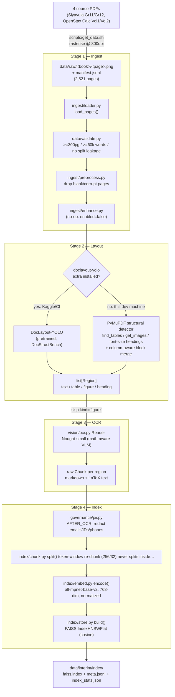

# Knowledge-base pipeline diagram (A2)

The A2 scope is Stages 1-4 of the fixed 9-stage pipeline (`src/doc_agent/pipeline.py::build_knowledge_base`).
Enhancement is a no-op for us (A1 finding: corpus is clean, born-digital PDFs, nothing to repair).

**Compute split**: Stage 1 and Stage 2's classical fallback are cheap/CPU-only. Stage 2's DocLayout-YOLO
path and Stage 3's Nougat OCR are the expensive steps — verified end-to-end on this CPU-only dev
machine at small scale via `configs/config.yaml: dev.max_pages` (a small number = fast local
correctness check; `0` = the full corpus). The actual 2,521-page build runs unmodified —
same `scripts/build_index.sh`, same `configs/config.yaml`, just `dev.max_pages: 0` and a GPU
runtime — on Kaggle T4x2, since Nougat OCR at this scale is impractical on CPU alone.

**Why this shape**: Stage 2's dual-backend design (pretrained model with a deterministic fallback)
exists because `doclayout-yolo`'s dependency chain needs a native toolchain unavailable on Windows —
rather than block local development on that, `layout.py` degrades gracefully to a detector that reads
the original born-digital PDF's own structure directly, which is arguably *more* reliable for our
specific corpus (clean, born-digital, not scanned) than inferring layout from a flattened image.
